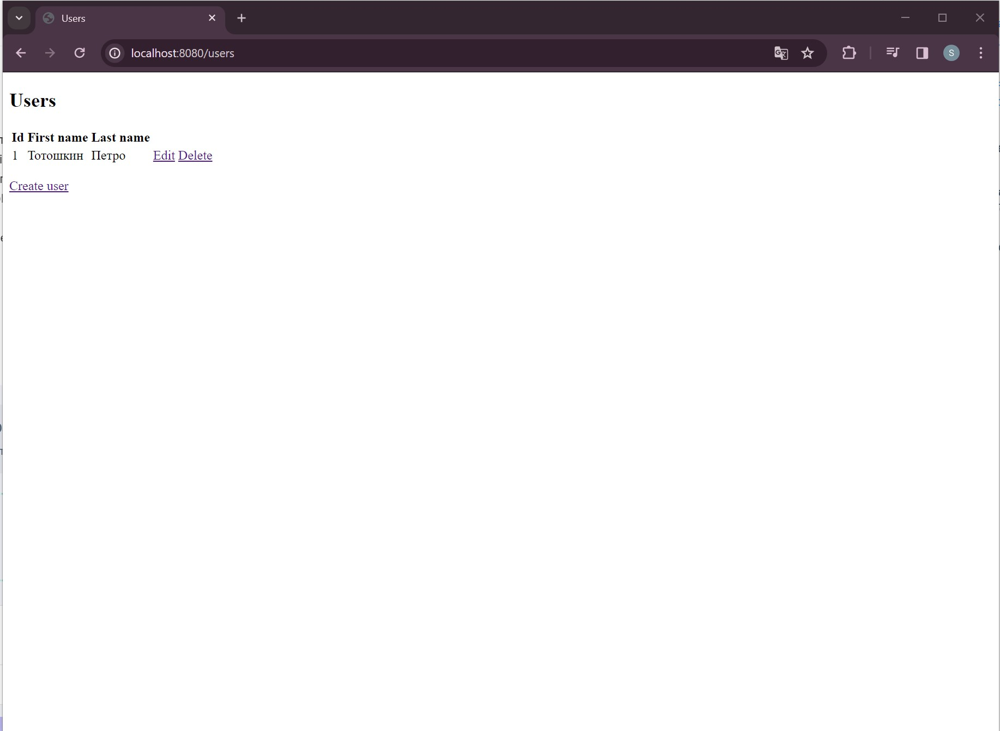

## Фреймворк Spring

Урок 1. Системы сборки Maven и Gradle для разработки Java приложений

        Создать проект с использованием Maven или Gradle, добавить в него несколько зависимостей и написать код, использующий эти зависимости.
        Пример решения:
        1. Создайте новый Maven или Gradle проект, следуя инструкциям из блока 1 или блока 2.
        2. Добавьте зависимости org.apache.commons:commons-lang3:3.12.0 и com.google.code.gson:gson:2.8.6.
        3. Создайте класс Person с полями firstName, lastName и age.
        4. Используйте библиотеку commons-lang3 для генерации методов toString, equals и hashCode.
        5. Используйте библиотеку gson для сериализации и десериализации объектов класса Person в формат JSON.

Урок 2. Основы Spring. Spring Boot

        Базовое задание:
        Добавить в простое CRUD веб-приложение, которое было разработано на семинаре функцию удаления данных о пользователе:
        1) В класс UserRepository добавить метод public void deleteById(int id) удаления записи пользователя из БД по ID.
        2) В класс UserService добавить метод public void deleteById(int id) удаление пользователя через репозиторий.
        3) В класс UserController добавить метод public String deleteUser(@PathVariable("id") int id) перехват команды на удаление студента от браузера.

        Если задание выполнено верно, то при запуске приложения по адресу http://localhost:8080/users будет работать кнопка удаления пользователя по ID.

        Задание "со звездочкой":
        Реализовать метод обновления данных о пользователе.
        - @GetMapping("/user-update/{id}")
        - @PostMapping("/user-update")
        - User update(User user)
        - User getOne(int id)

